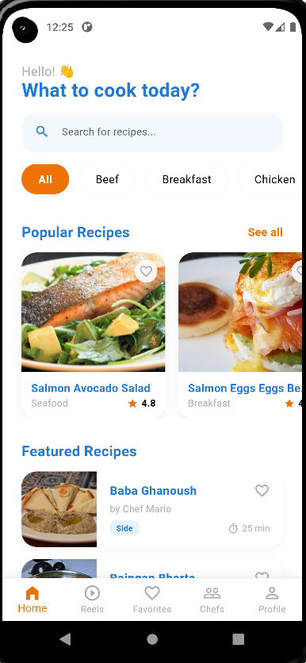
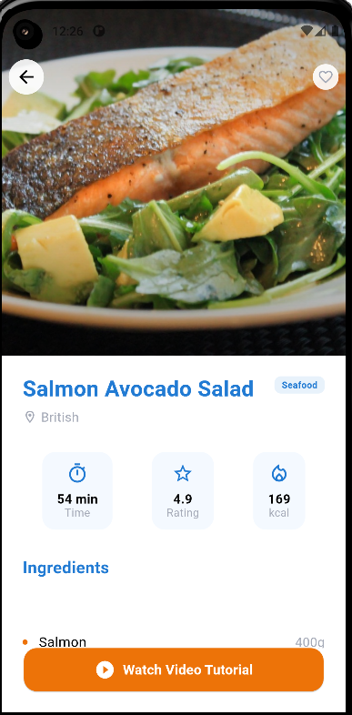
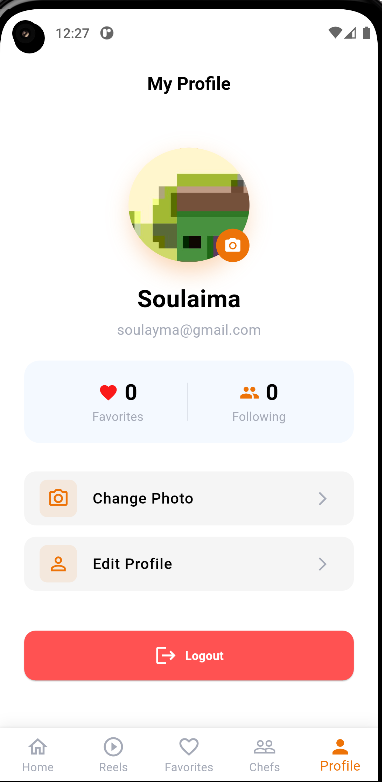

# SouChef 👨‍🍳

SouChef is a premium culinary application built with Flutter, designed to help users discover recipes, follow professional chefs, and master the art of cooking. With a focus on a modern, intuitive user experience, SouChef leverages the MVVM architecture and robust state management to deliver a seamless performance.

---

## 📑 Table of Contents

- [Features Overview](#-features-overview)
- [Project Structure](#-project-structure)
- [Architecture & Tech Stack](#-architecture--tech-stack)   
- [Module Breakdown](#-module-breakdown)
- [Screenshots Gallery](#-screenshots-gallery)
- [Installation & Setup](#-installation--setup)

---

## 🌟 Features Overview

- **🔐 Secure Authentication**: Full sign-up and login functionality powered by Firebase Auth, including email validation and secure session management.
- **🍛 Recipe Discovery**: Explore a vast collection of recipes with detailed insights such as preparation time, calorie count, and difficulty ratings.
- **👨‍🍳 Chef Network**: Browse profiles of top chefs, view their specialties, and follow them to stay updated with their latest creations.
- **🎥 Cooking Reels**: engaging short-form video content to learn cooking tips and tricks in an interactive way.
- **👤 User Profile**: Comprehensive profile management allowing users to update their personal details and profile picture.
- **❤️ Favorites**: A dedicated space to save and organize your most-loved recipes for quick access.
- **🌓 Adaptive Design**: Fully responsive UI that adapts perfectly to various screen sizes, ensuring a consistent experience across devices.

---

## 📂 Project Structure

The project is organized to promote modularity and scalability, separating core utilities from feature-specific code.

```
lib/
├── core/                                # 🧱 Core Layer: Shared resources across the app
│   ├── them/                            # 🎨 Theme Configuration
│   │   └── app_theme.dart               # Light/Dark mode and text styles
│   ├── utils/                           # 🛠️ Utilities
│   │   └── constants.dart               # Global constants (API keys, strings)
│   └── widgets/                         # 🧩 Common Widgets
│       ├── custom_button.dart           # Reusable styled buttons
│       └── custom_textfield.dart        # Standardized input fields
│
├── features/                            # 🚀 Features Layer: Modular functionality
│   ├── authentification/                # 🔐 Authentication Module
│   │   ├── model/                       # User data models
│   │   ├── view/                        # UI: Login & Sign Up screens
│   │   │   ├── login_view.dart
│   │   │   └── sign_up_view.dart
│   │   └── viewmodel/                   # Logic: Auth state & Firebase calls
│   │
│   ├── home/                            # 🏠 Home & Discovery Module
│   │   ├── model/                       # Data: Recipe, Chef models
│   │   ├── view/                        # UI: Home dashboard, Details
│   │   │   ├── home_view.dart
│   │   │   └── recipe_detail_view.dart
│   │   └── viewmodel/                   # Logic: Fetching recipes, favorites
│   │
│   ├── intro/                           # 👋 Onboarding Module
│   │   ├── view/                        # Splash & Welcome screens
│   │   └── viewmodel/                   # Logic: First-run checks
│   │
│   └── profile/                         # 👤 User Profile Module
│       ├── view/                        # Profile settings UI
│       └── viewmodel/                   # Logic: Profile updates
│
├── firebase_options.dart                # 🔥 Firebase Generated Config
└── main.dart                            # 🏁 App Entry Point & Provider Setup
```

---

## 🏗️ Architecture & Tech Stack

This project strictly follows the **MVVM (Model-View-ViewModel)** architectural pattern.

### Architecture Breakdown
- **Model**: Data classes defining the structure of objects (e.g., `Recipe`, `Chef`).
- **View**: UI components responsible for rendering the interface and capturing user input.
- **ViewModel**: Business logic layer that processes data, handles state changes, and communicates with the View via `Provider`.

### Technology Stack
| Category | Technology | Purpose |
|----------|------------|---------|
| **Framework** | Flutter | Cross-platform UI toolkit |
| **Language** | Dart | Programming language |
| **State Management** | Provider | Efficient state injection and notification |
| **Backend** | Firebase | Auth, Database, and Analytics |
| **Networking** | HTTP | API communication |
| **UI/UX** | ScreenUtil | Responsive design adaptation |

---

## 📦 Module Breakdown

### 1. Authentication (`features/authentification`)
Handles all user identity operations.
- **Components**: `LoginView`, `SignUpView`
- **Logic**: validatiion of inputs, communication with Firebase Auth, error handling.

### 2. Home & Discovery (`features/home`)
The core experience of the application.
- **Components**: `HomeView`, `RecipeDetailView`, `ChefListView`.
- **Logic**: Fetching recipe data, filtering categories, managing chef lists.

### 3. Onboarding (`features/intro`)
Guides new users through the app's value proposition.
- **Components**: `SplashView`, `WelcomeView`, `IntroView`.
- **Logic**: Session checks (auto-login), first-time user guidance.

### 4. Profile (`features/profile`)
Personalization hub for the user.
- **Components**: `ProfileView`.
- **Logic**: Editing user data, profile image updates, settings management.

---

## 📸 Screenshots Gallery

| Login | Home |
|:---:|:---:|
|  |  |
| **Recipe Detail** | **Profile** |
|  |  |

---

## 🚀 Installation & Setup

Follow these steps to get a local copy up and running.

### Prerequisites
- **Flutter SDK**: `^3.5.4`
- **Dart SDK**: Included with Flutter
- **Firebase Project**: You need a `google-services.json` (Android) or `GoogleService-Info.plist` (iOS) from your Firebase Console.

### Steps

1. **Clone the Repo**
   ```bash
   git clone https://github.com/yourusername/souchef.git
   cd esame
   ```

2. **Install Dependencies**
   ```bash
   flutter pub get
   ```

3. **Configure Firebase**
   - Place `google-services.json` in `android/app/`.
   - Place `GoogleService-Info.plist` in `ios/Runner/`.

4. **Run the App**
   ```bash
   flutter run
   ```
